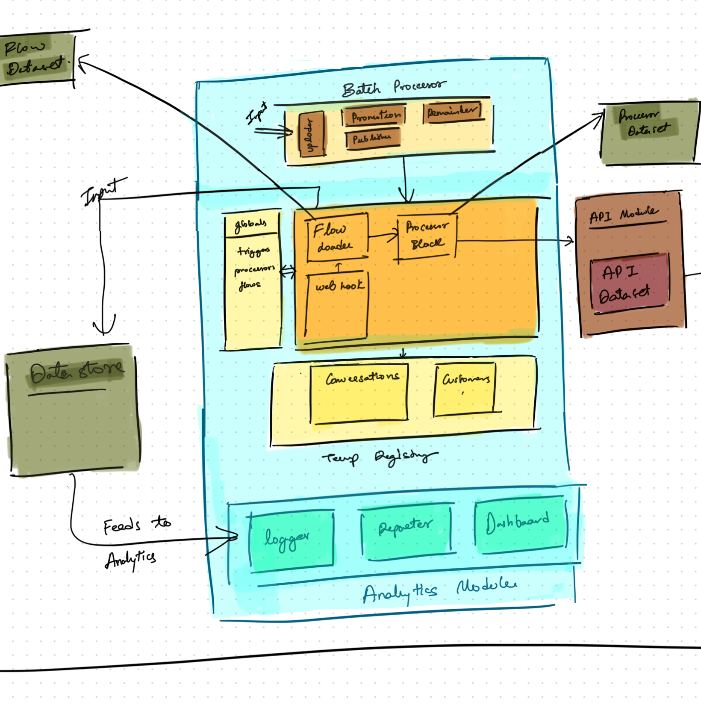

# **Talk to Your Customers, Like a Pro!** 💬

Welcome to the ultimate WhatsApp communication tool you didn’t know you needed! With a drop of a simple JSON file, you can build workflows and chat interactions like a boss. The Tool relies on WhatsApp Business API, so you'll need to connect your Whatsapp developer account. 

---

## **Key Objectives**
- Introduce new WhatsApp communication flows with just a drop of new JSON file in **Flows Module**.
- Allow seamless communication with backend systems via API's, by simply adding a python function in **Processors module**.
- Enable real-time analytics and reporting through the **Analytics Module**.
- To Support batch operations like promotions, remainders via WhatsApp with just an excel upload.
---

## **System Architecture**
Below is a visual representation of the system's architecture to help you understand how all the components work together.  

---

### **Things you should know first!!!**

#### **Flows**
   - A Flow is a JSON file, that describes your conversations.
   - A Flow has a trigger message, and whenever we detect a user sending that trigger message to us, we initiate the flow.
   - A Flows must have a list of Steps, Now a Step is the most basic unit of our Flow. Flows are made up of Steps.
   - Each step tells the system, what you intend to do. What kind of message you want to send to the user.

#### **Registries**
  - Registries are like little data holding silos, we've got 2 of those
   - The Global Registry holding the least frequently updated data, which is shared globally between the conversations.
   - The Temp Registry holding volatile data that lasts per user, as long as the conversation is valid.   

#### **Processors**
   - A Processor in simple language is a python function or a script. You mention them in your flows, add them into the Processors directory and that's it, you'll be able to use them wherever you want. 
   - We attach Processors to our Flows to make them more powerful, based on how you attach them you can run them as pre-processors or post-processors

#### **DataStore**
   - It's a Data Dump. (Not yet sure, how I'm gonna use this. But this will be needed)

#### **DataSets**
   - Datasets are nothing but a fancy name for Directories holding JSON files.
   - We have API Dataset that holds all the API's detials like URL, Payload, Headers and all the necessary stuff for the interaction.
   - Each file in this directory, represents a record. 

### **Core Components**
#### **Core Block**
The heart of the system, responsible for orchestrating workflows and interacting with registries, API's etc...

- **Flow Loader**:  
  - The Flow Loader, loads the flow json files in to our tool.
  - It validates the flows and verfies conflicts with already registered flows.
  - Registers workflows into the Global Registry using the Flow Dataset.  
  - Each JSON file in the dataset represents a workflow entry.

- **Webhook**:   
  - Handles incoming communications and maps them to appropriate conversation flow.

- **Processor Block**:  
  - This block loads our processors.
  - Executes processes based on the flow's configuration.  
  - Integrates with the **API Module** for communication with 3rd party systems.

- **API Module**:  
  - Enables and Manages the interaction with external systems.  
  - All APIs are documented in the **API Dataset** (a directory of JSON files).

#### **Registries**
- **Global Registry**:  
  - Stores universal and static data shared across flows, processors, users and customers.  
  - Manages flows, triggers, processors, and their mappings.

- **Temp Registry**:  
  - Tracks active conversations and customer responses.  
  - Stores ephemeral data and cleans up post-conversation.
   
---

## **Datasets**
1. **Flow Dataset**:  
   - Directory where each JSON file represents a workflow entry.

2. **API Dataset**:  
   - Contains API metadata for external system communication.

---

### **Supporting Systems**
#### **Batch Processor**
Handles data ingestion and periodic tasks. Submodules include:
- **Uploader**: Manages excel uploads for Bulk operations like promotion, remainders.  
- **Promotion Module**: Handles promotional campaigns.   
- **Publisher Module**: Publishes processed data externally.  
- **Remainder Module**: This module will handle the timely remainder notifications.

#### **Analytics Module**
Your reporting and visualization powerhouse!  
- **Logger**: logs important activities for further analytics.  
- **Reporter Module**: Generates comprehensive reports on demand.  
- **Dashboard Module**: Visualizes system stats and performance metrics in real time.

---

## **Features**
1. **Easy configurations**:

2. **Quick Bulk operations**:

3. **Analytics Module**:

4. **Plug and Play Model**:
 
---

## **Upcoming Features 🚀**
1. **Enhanced Reporting**:  
   - Customizable templates for detailed reports.  
   - Export reports in multiple formats (PDF, Excel).

2. **Improved Error Handling**:  
   - Robust error tracking and alerting mechanisms.

3. **Dynamic Workflow Support**:  
   - Enable real-time updates to workflows without restarting the system.

4. **Distributed Architecture**:  
   - Introduce distributed processing for improved scalability.

5. **Enhanced API Module**:  
   - Add support for OAuth-based authentication.  
   - Expand API coverage for deeper integration.

---

## **How It All Comes Together**
This system is designed with modularity, scalability, and performance in mind. Whether it’s enabling seamless WhatsApp communication or offering real-time analytics, the architecture ensures that your business stays connected and efficient.

Let’s make communication smarter, faster, and more fun! 💌🎉
